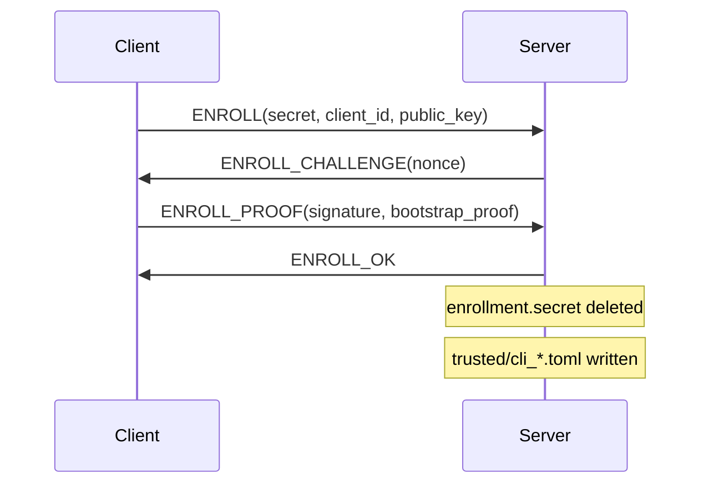

# BackupSAS Enrollment

Enrollment establishes **initial trust** between a client identity and a BackupSAS server before cryptographic proofs alone are sufficient (client not yet in trust store).

## Bootstrap secret

At `backupsas init` the server generates a one-time secret:

```
bs_enroll_<64 hex chars>
```

Stored on server as:

```
/var/lib/backupsas/enrollment.secret
secret_hash = blake3(secret)   # only hash stored
```

The plaintext secret is shown **once** to the operator. The client includes it in `BackupSasConfig` for the first connection only.

## Lifecycle



### Bootstrap proof

```
bootstrap_proof = blake3(enrollment_nonce || secret)
```

Server compares `blake3(bootstrap_proof)` against verification of secret via stored hash, using constant-time comparison.

### Enrollment signature

```
signed_message = enrollment_nonce || client_id || bootstrap_proof
signature = Ed25519_sign(client_secret, signed_message)
```

Proves the enroller holds the client private key matching `public_key`.

## After enrollment

- `enrollment.secret` file is **deleted** from disk
- Further enroll attempts fail with "enrollment secret is no longer available"
- Client connects via normal `CLIENT_PROOF` only
- Client must still pin `server_public_key` independently

## Trust store entry

```
/var/lib/backupsas/trusted/cli_<ulid>.toml
```

Contains: `id`, `public_key`, `fingerprint`, `repositories`, `enrolled_at`.

## Revocation

```bash
backupsas trust revoke cli_01J...
```

Removes trust entry. Client cannot authenticate until re-enrolled (requires new bootstrap secret — only possible before first enroll consumed the secret).

**Operational note:** after first enrollment, adding new clients requires either pre-seeding trust files administratively or a future key-rotation / admin enrollment protocol (Phase 5+).

## Security properties

| Property | Enforcement |
|----------|-------------|
| One-time secret | File deleted after successful `ENROLL_OK` |
| Constant-time compare | `secret_hash` vs presented secret |
| PoP at enroll | Ed25519 signature on challenge |
| Repo ACL | `repositories` list on trusted peer |

## Related

- [identity.md](identity.md)
- [threat-model.md](threat-model.md)
- [protocol-v2.md](protocol-v2.md)
