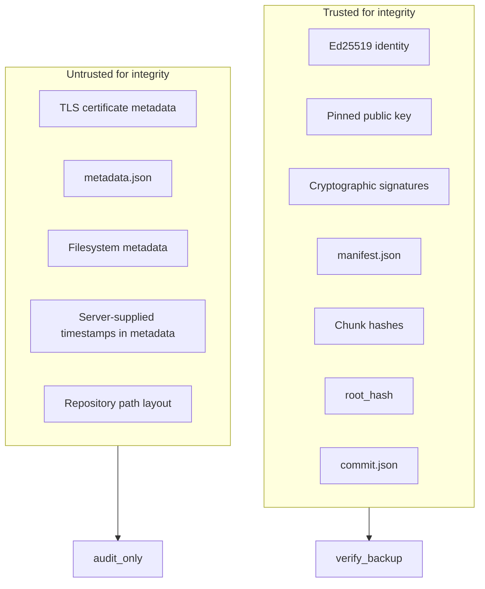

# BackupSAS Security Model

BackupSAS is an untrusted backup storage service. Clients push encrypted ciphertext; the server never receives decryption keys and never inspects database internals.

## Trust boundaries



## Trusted inputs

These define whether a backup is authentic and intact:

| Input | Role |
|-------|------|
| Ed25519 identity | Mutual authentication, proof-of-possession |
| Pinned `server_public_key` | Client rejects server identity changes |
| `manifest.json` | Chunk list, sizes, hashes, encryption metadata, `root_hash`, `manifest_hash` |
| Per-chunk BLAKE3 of ciphertext | Integrity of stored blobs |
| `root_hash` | Merkle root over chunk leaves (see [backup-format-v1.md](backup-format-v1.md)) |
| `commit.json` | Sole proof of `COMPLETE`; binds `root_hash` and `manifest_hash` |

Verification never reads `metadata.json`.

## Untrusted inputs

These are useful for operations and audit but **never** participate in cryptographic integrity:

| Input | Use |
|-------|-----|
| TLS server certificate | Transport encryption only; not BackupSAS identity |
| `metadata.json` | Server audit: `client_id`, `received_at`, `repository` |
| Filesystem inode/mtime | Operational; not signed |
| Server timestamps in metadata | Audit only |
| Repository directory path | Discovery; integrity from manifest + commit |

If `metadata.json` says `COMPLETE` but `commit.json` is missing or invalid, the backup is **not** complete.

## Key separation

| Key | Purpose | Held by |
|-----|---------|---------|
| Ed25519 identity key | Auth, enrollment, session proofs | Client and server (separate) |
| Backup DEK (AES-256-GCM) | Encrypt backup plaintext | Client only (e.g. Avrora vault) |
| HKDF session keys | Per-connection protocol binding | Client and server (derived) |
| TLS transport key | Channel encryption | TLS stack |

Stolen backup disk without DEK yields useless ciphertext.

## Lifecycle states

```
CREATING → UPLOADING → VERIFYING → COMPLETE
```

`COMPLETE` requires valid `commit.json` matching manifest. No state transition to `COMPLETE` without verify + commit.

## Zero-knowledge storage

BackupSAS may:

- Store ciphertext
- Verify hashes against manifest
- Delete backups
- Reject invalid uploads

BackupSAS may not:

- Decrypt backup content
- Obtain DEK or `key_id` secret material
- Infer database schema from backup layout

## Related documents

- [identity.md](identity.md)
- [enrollment.md](enrollment.md)
- [threat-model.md](threat-model.md)
- [backup-format-v1.md](backup-format-v1.md)
- [protocol-v2.md](protocol-v2.md)
